# DVS Final Project
Design of Visual Systems – Spring Term 2026 – Imperial College London

**Team Members:** 
 - Oliver Dai
 - Lynton Sutton
 - India Lloyd-Evans

## Project Summary
WIP - Describe what this program does in moderate detail.

## INSTRUCTIONS

### Prerequisites
- You must have Matlab installed
- Required add-ons:
  - Image Processing Toolbox
  - Computer Vision Toolbox
  - Computer Vision Toolbox Model for Text Detection
- Install via Matlab: Home → Add-Ons → Get Add-Ons → search and install the toolboxes above.

### Running the Code
1. Download or clone this project onto your computer.
2. Open the project's `matlab/` folder in Matlab.
3. Open and run `main.m` in Matlab. Be patient as it downloads the dataset on your first run.
4. Select an image to process from the dialog that opens. You may have to navigate inside subfolders to find the images.

### For Contributors
All code and scripts go in the `matlab/` folder.
Non-dataset images and other resources go in the `assets/` folder.
All dataset images go in the `dataset/` folder, which will be **automatically generated** the first time you run the program. This folder is intentionally not saved to Github.

| file | instructions |
|--|--|
| `main.m` | The entrypoint into the program. Edit this file to change the dataset, image loading behavior, etc. |
| `process_image.m` | Contains our image processing logic. The `process_image()` function is the entrypoint. It is the "brains" that determines which image processing workflow to run. |
| `image_processing/*` | Our actual image processing workflows go in here. Make major edits as new files. Try to use functions to split image processing workflows into discrete, logical steps. This is a good organization practice and will help us understand each others' code. |

## Demo

### Workflow selection and image selection
When running `main.m`, first the dataset is downloaded to your project directory.

After the dataset is loaded, you must select an image processing pipeline to run. Each version has a different method we've attempted to solve license plate detection. Notable versions are described in the **Project Summary** section.

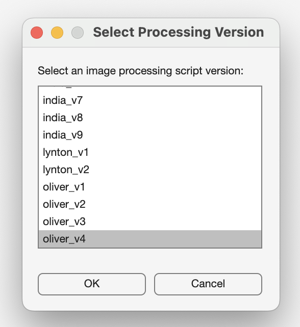

Then the user selects an image to process from the dataset directory.

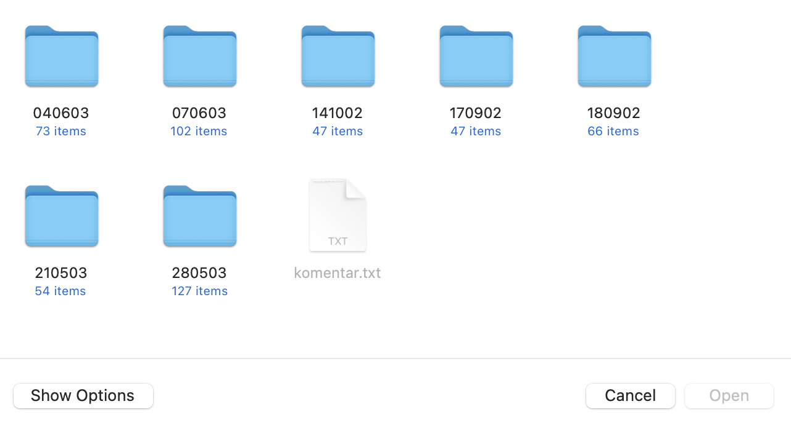
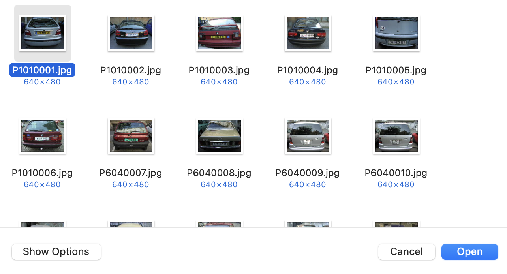

### Version: oliver_v4

This version excels at license plate detection and cropping. It has a high success rate at detecting the correct bounding box and rotating it to be horizontal. It makes an attempt at loading Matlab's built-in OCR model to read the license plate, but the result was ultimately very inconsistent.

> The original image, and the final cropped license plate region.\
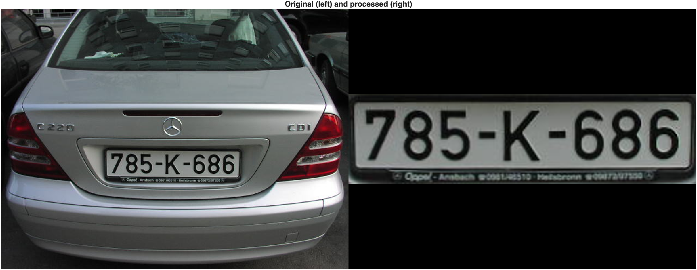

> Step 1: k-means segmentation into 8 segments\
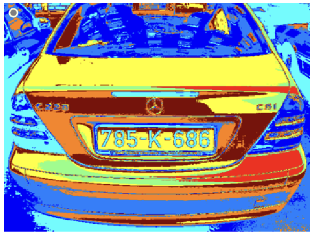

> Step 2: split up k-means segments\
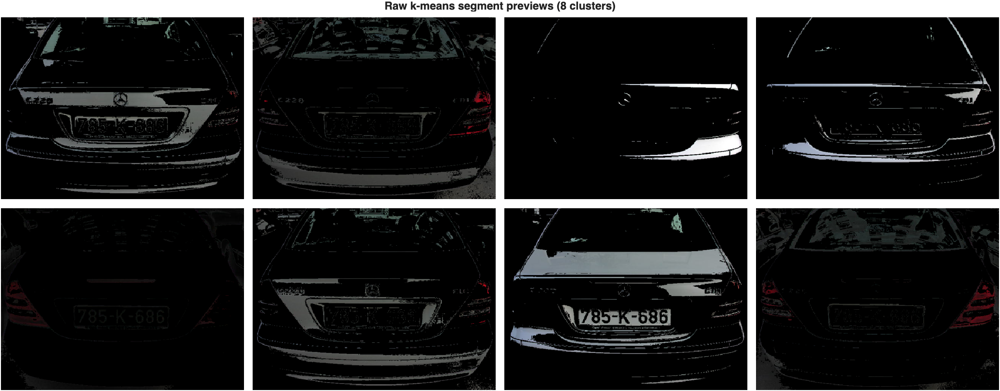

> Step 3: threshold, filter, and fill k-means segments\
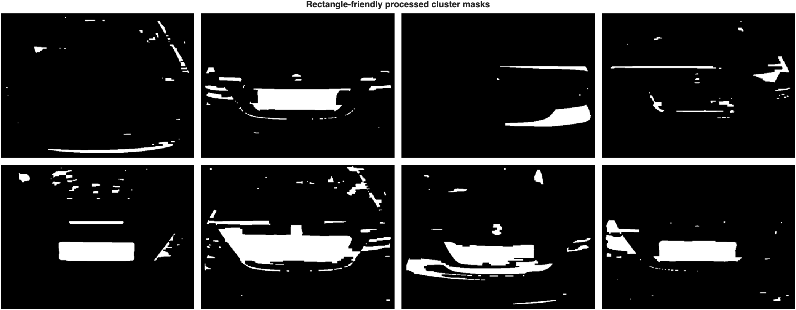

> Step 4: select best connected component based on a weighted score of aspect ratio, bounding box fill, and size.\
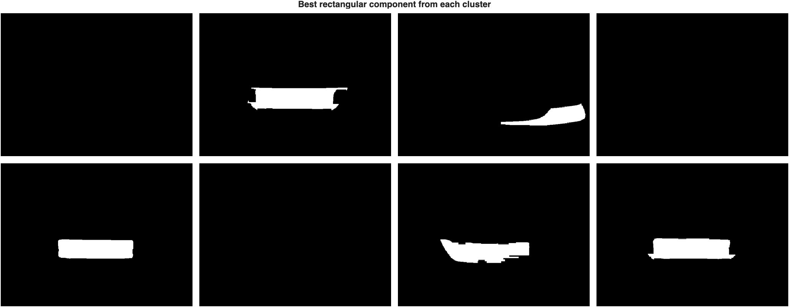

> Step 5: calculate the best rotated bounding box around the components, and select the one with the best fill.\
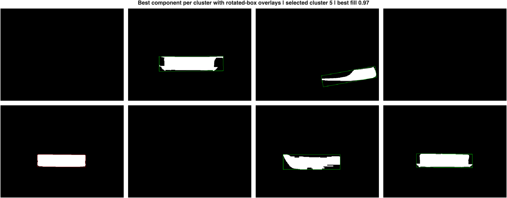

> Step 6: crop the best connected component, and rotate such that the rotated bounding box lies horizontally.\
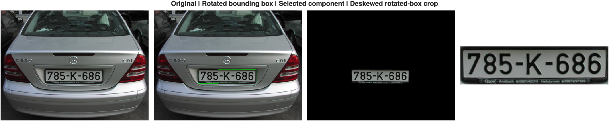

> Step 7: create many variations of license plates with different image processing steps.\
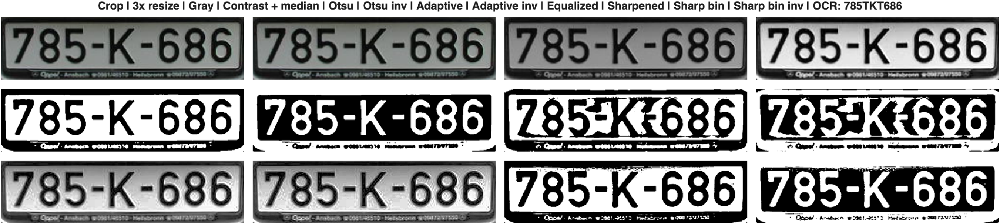

> Step 8: run built-in OCR model.\
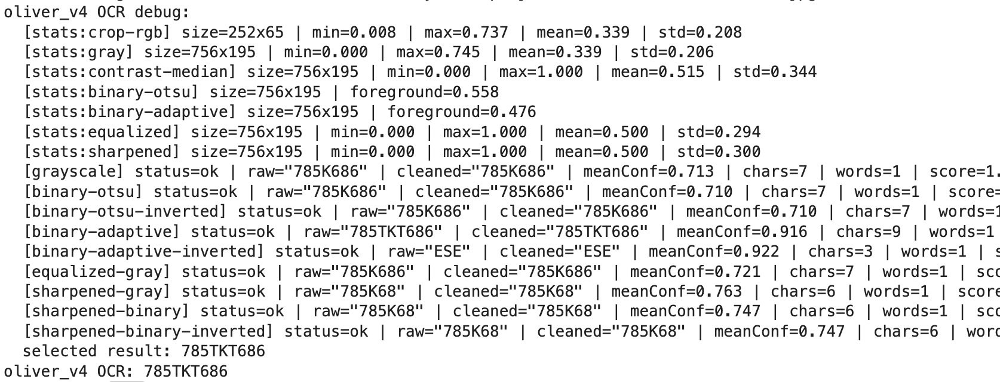

**Result: 785TKT686**

### Version: india_v9

india's description here TODO...

> The original image, and the final cropped license plate region.\
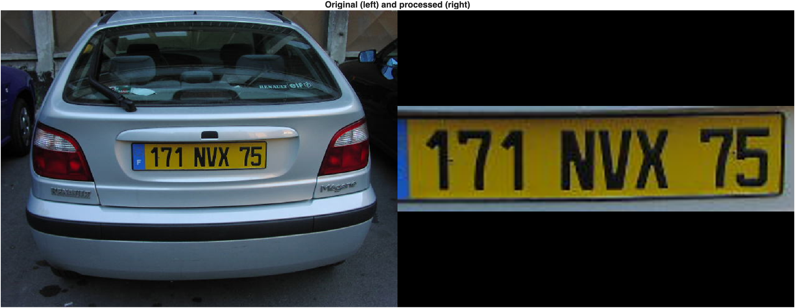

> Step 1: greyscale and pre-processing\
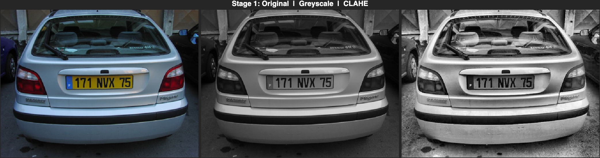

> Step 2: sobel edge detection, yellow mask, and white mask\
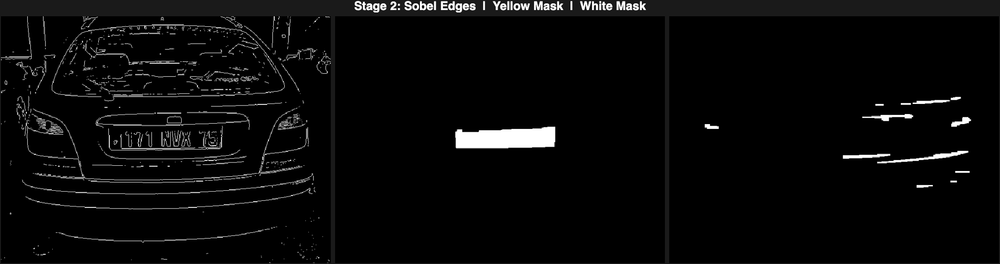

> Step 3: plate candidate selection and binarization\
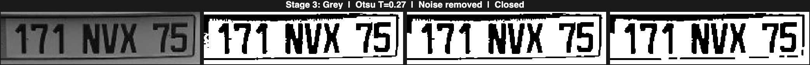

> Step 4: INDIA TODO...\
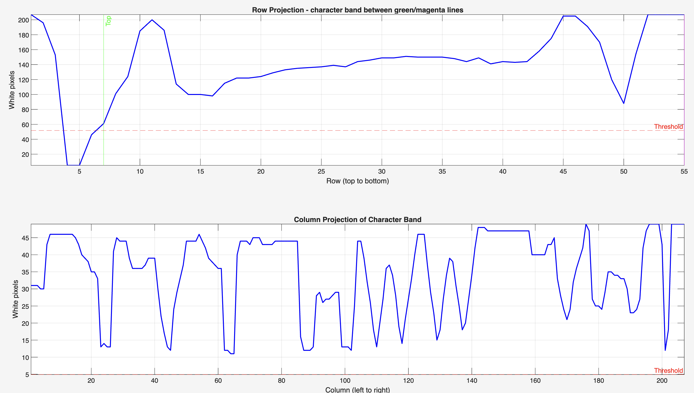

> Step 5: find individual character blobs
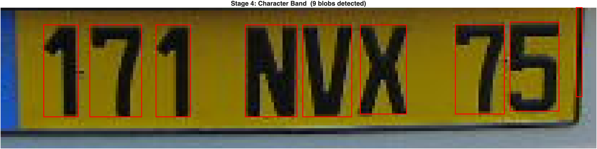

> Step 6: threshold and upscale for OCR\
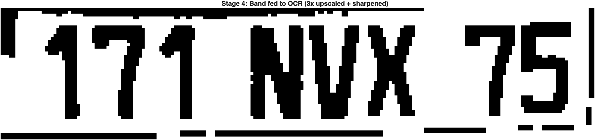

> Step 7: run OCR\
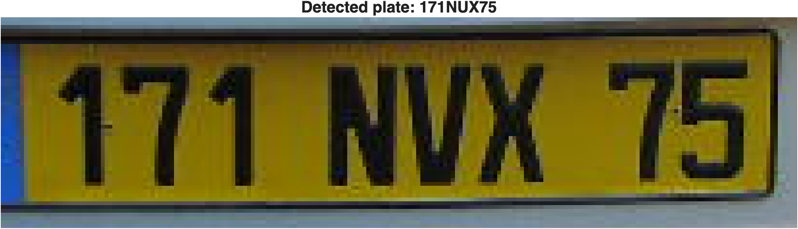

**Result: 171NUX75**\
Almost perfect, but it mistook "V" for a "U".

## Analysis
WIP - A bit of critical analysis of the program's functionality, areas for improvement, practical value, etc…
