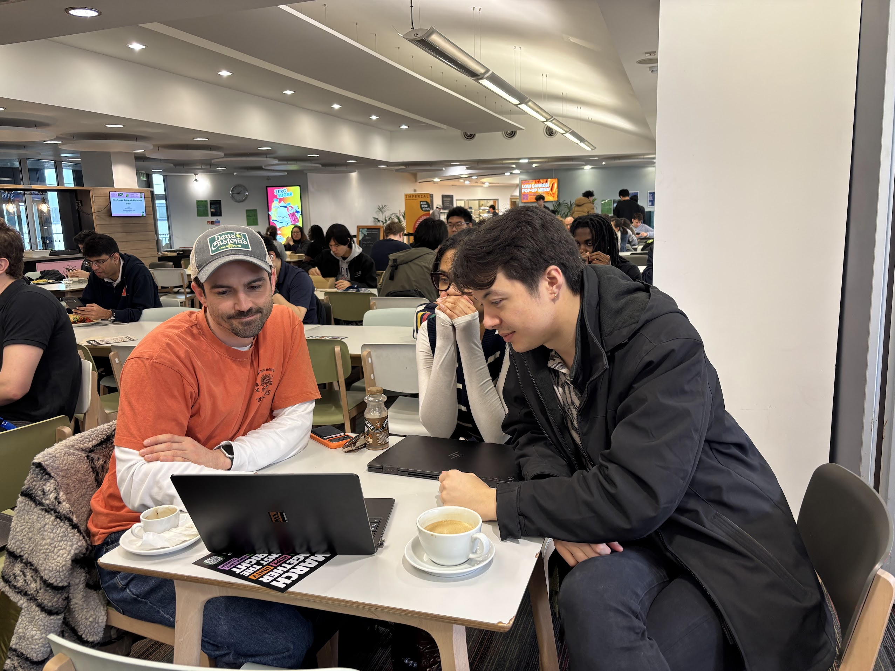
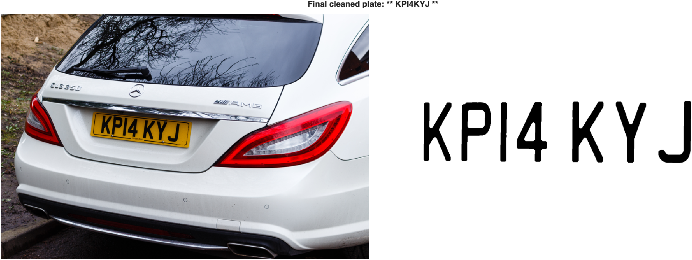
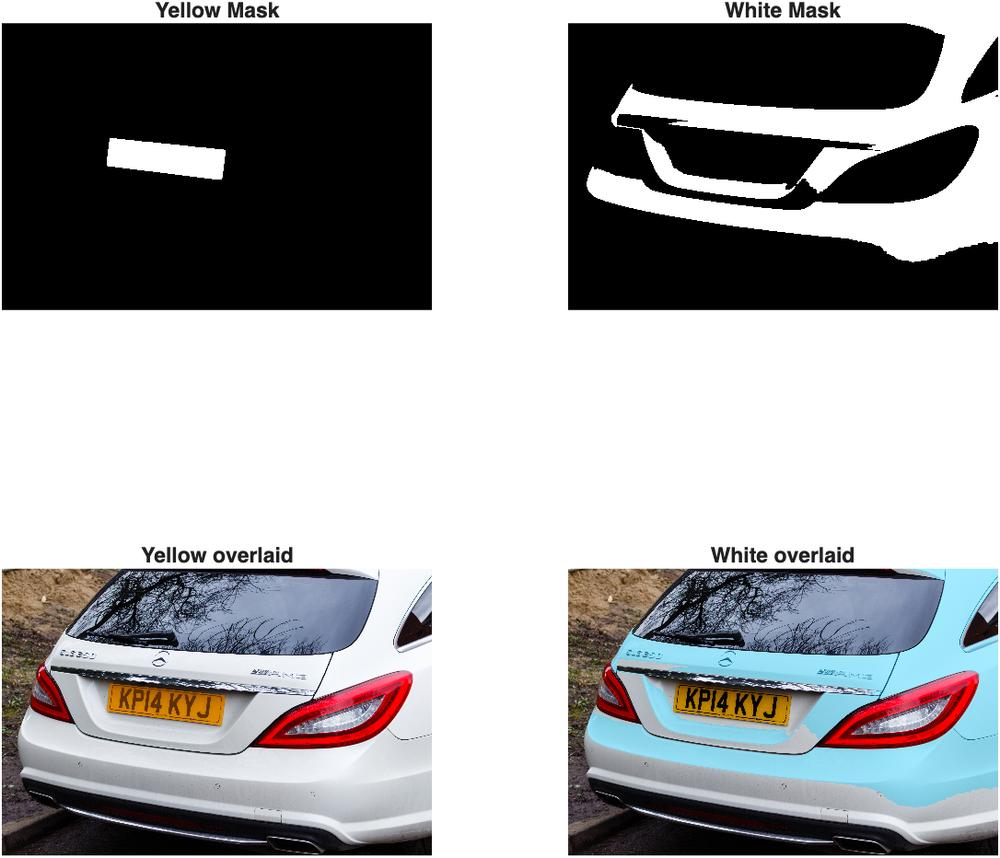
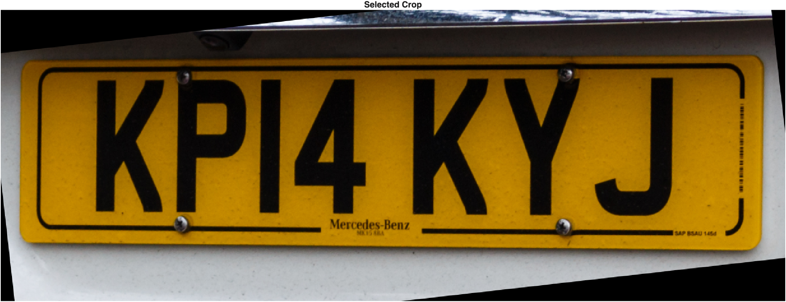
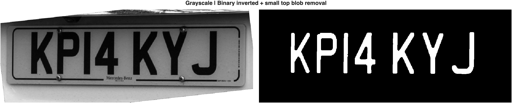

# DVS Final Project
Design of Visual Systems – Spring Term 2026 – Imperial College London

**Team Members:** 
 - Oliver Dai
 - Lynton Sutton
 - India Lloyd-Evans

## Project Summary
We chose the task of vehicle number plate recognition. We picked this because there was opportunity to apply our learning of multiple detection methods and colour processing. Challenges we faced in our attempts were largely to do with the different colour contrasts and angular positioning of the number plates in different test images from the dataset – isolating the number plate as a rectangular box amidst shadowing also meant crops became too tight. We employed OCR as the ‘reading’ program, which was somewhat accurate, with slight error in recognising similar characters such as ‘7’ and ‘T’, as well as ‘U’ and ‘V’, but this was not something we focused on solving. 

Overall, we made many attempts with roughly 17 different methods, of which we have documented 10. To see the results for yourself, we recommend trying versions ‘oliver_v4’, ‘lynton_v3’ and ‘india_v9’, which are the best versions developed by each team member. 'oliver_v4' and 'lynton_v3' demonstrate the best segmentation-based image processing pipelines. 'india_v9' achieved the best plate-reading OCR accuracy across multiple attempts. 

## INSTRUCTIONS

### Prerequisites
- You must have Matlab installed
- Required add-ons:
  - Image Processing Toolbox
  - Computer Vision Toolbox
  - Computer Vision Toolbox Model for Text Detection
- Install via Matlab: Home → Add-Ons → Get Add-Ons → search and install the toolboxes above.

### Running the Code
1. Download or clone this project onto your computer.
2. Open the project's `matlab/` folder in Matlab.
3. Open and run `main.m` in Matlab. Be patient as it downloads the dataset on your first run.
4. Select an image to process from the dialog that opens. You may have to navigate inside subfolders to find the images.

### For Contributors
All code and scripts go in the `matlab/` folder.
Non-dataset images and other resources go in the `assets/` folder.
All dataset images go in the `dataset/` folder, which will be **automatically generated** the first time you run the program. This folder is intentionally not saved to Github.

| file | instructions |
|--|--|
| `main.m` | The entrypoint into the program. Edit this file to change the dataset, image loading behavior, etc. |
| `process_image.m` | Contains our image processing logic. The `process_image()` function is the entrypoint. It is the "brains" that determines which image processing workflow to run. |
| `image_processing/*` | Our actual image processing workflows go in here. Make major edits as new files. Try to use functions to split image processing workflows into discrete, logical steps. This is a good organization practice and will help us understand each others' code. |

## Demo

### Workflow selection and image selection
When running `main.m`, first the dataset is downloaded to your project directory.

After the dataset is loaded, you must select an image processing pipeline to run. Each version has a different method we've attempted to solve license plate detection. Notable versions are described in the **Project Summary** section.

Then the user selects an image to process from the dataset directory.

### Version: oliver_v4

This version excels at license plate detection and cropping. It has a high success rate at detecting the correct bounding box and rotating it to be horizontal. It makes an attempt at loading Matlab's built-in OCR model to read the license plate, but the result was ultimately very inconsistent.

> The original image, and the final cropped license plate region.

> Step 1: k-means segmentation into 8 segments

> Step 2: split up k-means segments

> Step 3: threshold, filter, and fill k-means segments

> Step 4: select best connected component based on a weighted score of aspect ratio, bounding box fill, and size.

> Step 5: calculate the best rotated bounding box around the components, and select the one with the best fill.

> Step 6: crop the best connected component, and rotate such that the rotated bounding box lies horizontally.

> Step 7: create many variations of license plates with different image processing steps.

> Step 8: run built-in OCR model.

**Result: 785TKT686**

### Version: india_v9

This code centralises OCR preprocessing, successfully cropping the perimeter of the number plate (although performance varies with colour contrasts), attempting to binarise the image and identify regions of interest based on identifying a sequence of black and white distribution, similar to barcode recognition. 

> The original image, and the final cropped license plate region.

> Step 1: greyscale and pre-processing

> Step 2: sobel edge detection, yellow mask, and white mask

> Step 3: plate candidate selection and binarization

> Step 4: Top graph reads the cropped number plate image row by row to plot the white distribution. Below, the peaks and troughs represent the spacing of the characters, allowing for them to be detected for the OCR program

> Step 5: find individual character blobs

> Step 6: threshold and upscale for OCR

> Step 7: run OCR

**Result: 171NUX75**\
Almost perfect, but it mistook "V" for a "U".

### Version: lynton_v3

This code used a basic yellow/white HSV filter to create a mask, then chooses the most rectangular (i.e. license-plate) shape. It then crops the image according to the mask, then runs a series of image processing steps to show just the text of the number plate, and finally runs the 'OCR' function (computer vision toolbox) to read the text and return the alphanumeric value of the license plate. 

> The original image, and the final cropped, deskewed, and cleaned image with correct output license plate reading.

> HSV color mask (yellow and white masks processed in parallel). Selects the most plate-like mask.

> Initial plate boundary selection, padding, cropping, and deskewing.

> Increase contrast and brightness. Binarize, dilate, erode, close, then image colour inversion and finally an 'opening' step to close the small 'blobs'. 

**Result: KPI4KYJ**

## Analysis
What Worked Well:

 - 'k-means' segmentation was superb at isolating the license plate "rectangle". This allowed us to use simple techniques to isolate the most promising connected components, like connected component weighted scoring (aspect ratio, fill, and size weighted scoring) and morphological operations like erosion, dilation, and geodesic dilation for reconstruction. 
 - Yellow-plate detection using HSV colour masking worked quite well after parameter tuning. Once the correct Hue/Saturation/Value ranges were found, it isolated the plate with minimal noise. 
 - High-sensitivity adaptive binarization (Sensitivity 0.99) combined with morphological operations effectively removed background noise while preserving characters.
 - When experimenting with CRAFT, it reliably located the plate region even under moderate angles and varying lighting.

What Didn't Work: 

 - Whilst Yellow-plate detection using HSV colour masking worked well, it was not robust and only worked for 1 test image. When using different data sets the HSV ranges would need to be tuned. An adaptive version would be necessary.
 - For OCR to correctly read the number plate, the characters of the plate would need to be perfectly isolated, any noise or additional 'blobs' would lead to errors or partial readings.
 - Hough transform was not able to identify vertical lines. This proved quite challenging as we were unable to consistently utilize it for identifying the straight edges of the license plate. 
 - White front plates proved significantly harder than yellow rear plates because of similarity to car body paint and reflections. Many images have overall low contrast, with lots of muted light grays and silvers.
 - Purely rule-based methods (HSV + morphology) struggled with strong parallax and diverse lighting conditions

Areas for Improvement: 

 - Our script pulls a limited dataset consisting mostly of car license plates from the rear. Future scripts should be tested on a more varied and robust selection of images, from wider angles and more varied distances.
 - Overall, our OCR accuracy was poor. It may pay to utilize a better model, or one trained specifically on car number plates.
 - Full automation of region selection: develop a scoring system that combines CRAFT confidence, aspect ratio, and plate-like shape.
 - Perspective correction: Automatically detect and unwarp trapezoidal plates caused by side angles (currently only basic deskewing is used).
 - Hybrid OCR engine: Integrate EasyOCR or PaddleOCR (via Python) for higher character recognition accuracy on challenging plates.
 - Multi-plate support: Extend the system to handle images containing multiple vehicles.
 - Performance optimisation: Add GPU support for CRAFT and explore newer models such as YOLOv8 for plate detection.

## Team Member Contribution Statements

### India Lloyd-Evans statement of contribution

My attempts of the task involved working backwards from the desired outcome in order to meet my teammates in the middle. As I worked through the code iterations, it became more evident that image preprocessing such as making the image greyscale and toggling the threshold for exposure became necessary to isolate the plate and its characters. As my teammates worked on configurations using boundary detection and text transforms, I looked to methods from YouTube and example projects on MATLAB to identify disruptive techniques such as tracking the distribution of white in an image to get a region of interest (ROI) around the plate. Some projects I found used training data of individual car plate characters which I found interesting but excessive for this task. I found OCR best - next time I would include a confidence score so that the user of the program could quantify the model’s accuracy in reading the plate for troubleshooting and debugging purposes.

### Lynton Sutton statement of contribution

The objective of my code was to develop a simple 'MVP', demostrating a successful license plate reading of a single test image. I started by researching standard practices, it became clear that multiple approaches are adopted commercially. I then decided to develop an image processing pipeline from first priciples. Starting with a test image, I noticed that the yellow license plate stood out from the colours in the rest of the image. I applied a colour filter, this worked successfully. I then tried to expand the code to work for both yellow and white number plates, however detection of white license plates proved to be significatly more challenging as the colour filter would also pull through silver body trim and reflections on paintwork. This lead me to believe additional parallel processes would likely be necessary in combination with colour filtering. I tried hough transform to detect the edges of the plate, although vertical lines were not detected, I also tried filtering the image by kmeans, this proved promising. Combining methods in a parallel image processing pipeline was the next step. Automating selection of the correct kmeans image mask was the next problem to work on. Additionally, working on an adaptive HSV colour filter would also be necessary, to ensure success on a wider range of images. 

### Oliver Dai statement of contribution

I contributed primarily by implementing image processing workflows with an emphasis on **robust** license plate boundary detection and cropping. I also contributed by setting up most of the project's boilerplate like dataset fetching and image selection logic, managing and maintaining the Github repository, and setting up the README.md file with detailed setup instructions. 

My image processing pipelines started with simple linear filters and morphological operations. I found that the variability in the dataset required more sophisticated methods, as simple operations weren't generalizable. My next versions focused on the Hough transform, and focused on isolating the strongest "straight line" segments to pinpoint the location of the license plate. Unfortunately, the Hough transform disproportionately prioritized the longer horizontal lines, and line segments would often get cut short, leading to misaligned license plate corners and incorrect bounding boxes. My later attempts revolved around k-means image segmentation. We found that license plates usually have a distinct color with a solid texture: a perfect candidate to be isolated using color-based segmentation. My last and best version 'oliver_v4' succeeded at robust license plate boundary detection, and works on a majority of the dataset's images (excluding the trucks folder). I also attempted to solve the inconsistent OCR issue by running OCR on ~12 variations of filtered cropped license place images. This helped, but ultimately does not solve the problem when the crop and filter isn't perfect.
